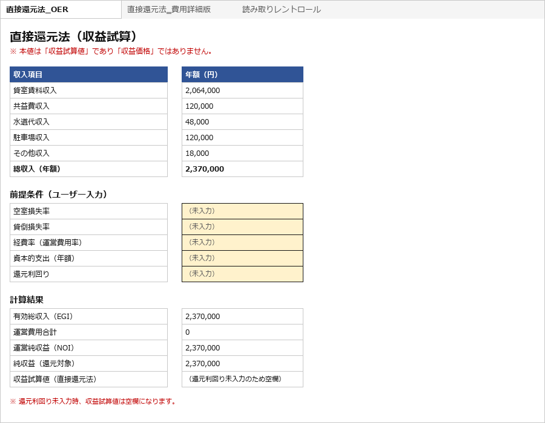
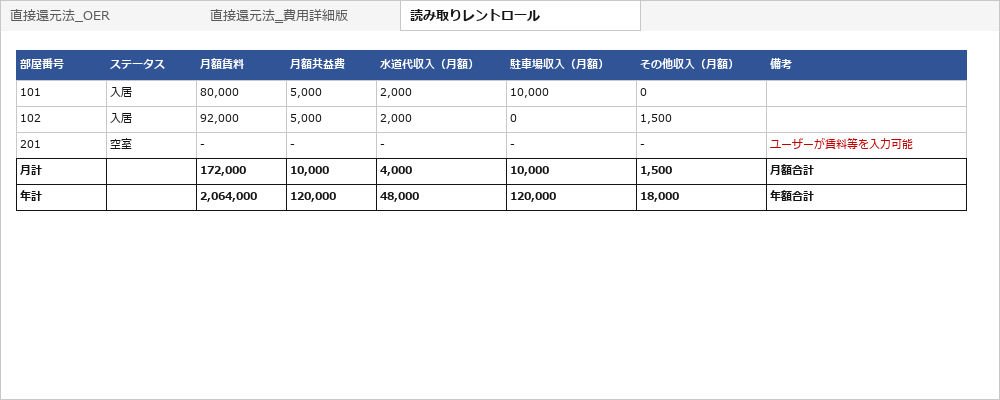

# revenue-kun（収益還元クン） v0.5.2

**Local-first OSS tool for real estate income-estimation workflows.**
Rent roll CSV / text-based PDF → direct-capitalization Excel workbook.
Available as a **CLI** (Docker-ready) and a **local Web UI** — not a hosted SaaS.

直接還元法による**収益試算ツール**。レントロール（CSV または テキスト抽出可能なPDF）と前提条件から
NOI（運営純収益）を算出し、**収益試算値**と感応度分析を出力します。
オプションで直接還元法 Excel ワークブック（`direct_cap.xlsx`）を生成できます。
**CLI**（Docker対応）に加えて、ブラウザから使える**ローカルWeb UI**もあります（ホスティング型SaaSではありません）。

> **v0.5.2 — OER版・費用詳細版の独立計算化（現行版）**  
> `direct_cap.xlsx` の製品境界を再確定しました。revenue-kun のゴールはレントロールを読み取り、`直接還元法_OER` / `直接還元法‗費用詳細版` / `読み取りレントロール` の3シートを生成するところまでです。アプリ（CLI / Local Web UI）は、OER方式と費用詳細方式のどちらを使うかを選ばせず、用途区分・OER・空室損失率・貸倒損失率・個別費用・資本的支出・還元利回りの入力も求めません。これらはExcel出力後に、利用者が必要に応じて各シートへ入力します。  
> 賃料・共益費・水道代収入・駐車場収入・その他収入といった経常的な付帯収入は、利用者の選択なしで両計算シートのGPIへ自動反映されます（**optional incomeのopt-in/opt-out選択は廃止**）。  
> `直接還元法‗費用詳細版` は、個別運営費用（管理費・修繕費・損害保険料・固定資産税・水道光熱費・その他運営費用）を入力すると、`直接還元法_OER` から完全に独立してEGI→NOI→純収益→収益試算値まで自算定します（旧バージョンの「経費率の妥当性確認用の参考表示」から変更）。両シートは互いの入力値・計算値・シートを一切参照しません。  
> `assumptions.yaml` の `optional_income.include_in_gpi` / `columns` 設定は非推奨です。後方互換のため引き続き受理しますが、計算結果には一切影響しません。  
> 同一ベンダー系または近似テンプレートとみられる非公開の実務レントロールPDF3件について、CLIおよびLocal Web UIからの抽出・Excel生成を確認済みです。テンプレート多様性の検証はIssue #21で継続しています（「実務PDF全般で検証済み」という意味ではありません）。

> **v0.5.1 — バージョン・ドキュメント整合パッチ**  
> v0.5.0（Local Web UI MVP）に対する、機能変更を伴わない version / documentation alignment patch です。  
> 内部 `__version__` と `VERSION` ファイルを公開版（GitHub Release / GitHub Pages LP）と整合させ、README の Docker Web UI 検証状況の記載を実機検証済みの内容に更新しました。  
> Local Web UI の主要機能（ブラウザからのアップロード・プレビュー・`direct_cap.xlsx` 生成/ダウンロード）は v0.5.0 で追加されたものであり、v0.5.1 での新規追加ではありません。  
> CLI は引き続き利用可能です。抽出ロジック・計算ロジック・Web UI の挙動・optional income の仕様に変更はありません。  
> 同一ベンダー系テンプレートとみられる非公開の実物件テキストPDF3件について、CLIおよびLocal Web UIからの抽出・Excel生成を確認済みです。テンプレート多様性の検証はIssue #21で継続しています。

> **v0.5.0 — Local Web UI MVP**  
> ブラウザから使えるローカルWeb UI（アップロード・プレビュー・`direct_cap.xlsx` 生成/ダウンロード）を追加。  
> `Dockerfile.web` による Web UI 用 Docker イメージを追加。  
> qualifying real-world PDF 評価は未完了（Issue #21 open）。実務検証済みとは表記しません。

> **v0.4.2 — Docker 対応・optional income 対応**  
> Docker build / run / pytest / Excel出力を実機検証済み。  
> optional income（水道代収入・駐車場収入・その他収入）の GPI opt-in に対応。  
> qualifying real-world PDF 評価は未完了（Issue #21 open）。実務検証済みとは表記しません。

> **v0.4.1 — 直接還元法 Excel ワークブック出力（`--excel-output`）**  
> `--excel-output <path>` を指定すると、抽出したレントロール行から3シート構成の直接還元法 Excel ワークブックを生成します。  
> 詳細は「[直接還元法 Excel ワークブック出力](#直接還元法-excel-ワークブック出力)」セクションを参照してください。  
> qualifying real-world PDF 評価は未完了（Issue #21 open）。実務検証済みとは表記しません。

> **v0.4.0 — PDF ingestion hardening**  
> Japanese status column detection を強化し、tenant-name / date-type 列の false positive を抑制しました。  
> total / summary 行（合計・小計・TOTAL 等）の除外フィルタを追加しました。  
> realistic anonymized サンプルで rows=20 / occupied=17 / vacant=3 / GPI=2,030,000 円/月 を確認済みです。  
> qualifying real-world PDF 評価は未完了（Issue #21 open）。実務検証済みとは表記しません。

> **v0.3.0 — CLI UX and diagnostics**  
> `--dry-run` モードと抽出診断サマリーを追加しました。PDF 抽出範囲は v0.2.0 と同じです。  
> text-based PDF（PyMuPDF で直接テキスト抽出できるもの）の単純なレントロール表に限定しています。  
> OCR・スキャンPDF・複数ページ結合・複雑な結合セル・PII マスキングは対象外です。  
> CSV 経路は引き続き利用できます。

> ## ⚠️ 重要な注意
> - **本ツールは不動産鑑定評価ではありません。**
> - 出力される金額は **「収益試算値」** であり、鑑定評価による **「収益価格」ではありません。**
> - **欠損項目は推測補完しません。** 不明な入力は `missing_info.md` に記録され、計算からは除外されます（その旨が警告されます）。
> - 正式な鑑定評価、価格判断、投資判断、法的判断が必要な場合は、不動産鑑定士、弁護士、税理士その他の専門家に確認してください。revenue-kun は、専門家による判断の前段階で、前提条件に基づく収益試算値を検算・整理するための補助ツールです。
>
> *For formal appraisal, pricing decisions, investment decisions, or legal/tax conclusions, consult a qualified real estate appraiser, attorney, tax advisor, or other relevant professional. revenue-kun is intended as a support tool for organizing and checking trial income estimates based on explicit assumptions before professional review.*

---

## Current status — what works today

| Capability | Status |
|---|---|
| CLI workflow | ✅ Implemented |
| Docker-ready CLI workflow | ✅ Implemented |
| Local FastAPI Web UI | ✅ Implemented |
| CSV input | ✅ Implemented |
| Text-based PDF input | ✅ Implemented |
| Rent-roll preview (Web UI) | ✅ Implemented |
| Missing-information preview (Web UI) | ✅ Implemented |
| Recurring-income preview (water / parking / other income) | ✅ Implemented |
| Recurring income auto-included in GPI (no selection needed) | ✅ Implemented (v0.5.2) |
| `direct_cap.xlsx` workbook generation (OER + expense-detail sheets, always both) | ✅ Implemented |
| Independent OER / expense-detail calculation sheets | ✅ Implemented (v0.5.2) |
| Workbook download (Web UI, via `/api/generate`) | ✅ Implemented |

See [Supported / unsupported inputs](#supported--unsupported-inputs) and [Roadmap](#roadmap) below for what is out of scope today.

## Quick Start

### A. Local Web UI — with Docker

```bash
docker build -f Dockerfile.web -t revenue-kun-web .
docker run --rm -p 127.0.0.1:8000:8000 revenue-kun-web
```

Then open `http://127.0.0.1:8000/` in your browser. The host side is bound to `127.0.0.1` (loopback) only — this is **not** exposed to the public internet, and this is **not** a hosted SaaS. Building/running this image requires a working Docker daemon.

> **Verified (Docker Desktop environment)**: `Dockerfile.web` build (both regular and `--no-cache`), loopback-bound `docker run`, `GET /healthz`, `POST /api/preview`, `POST /api/generate`, and `direct_cap.xlsx` generation (with independent OER / expense-detail sheets and recurring income auto-included in GPI) have all been confirmed to work as of v0.5.2.
>
> **Historical note**: in one earlier development sandbox (predating the verification above), no Docker daemon was available, so `docker build -f Dockerfile.web` / `docker run` could not be executed there at that time; `Dockerfile.web` was instead reviewed manually. Please open an Issue if you run into a build/run problem in your own environment.

### B. Local Web UI — without Docker

```powershell
python -m pip install -r requirements-web.txt
python -m uvicorn webui.app:app --host 127.0.0.1 --port 8000
```

### C. CLI workflow

The original CLI is unchanged — see [セットアップ](#セットアップ) / [実行（PowerShell）](#実行powershell) below for the full walkthrough, or jump straight in:

```powershell
python -m pip install -r requirements.txt
python src/main.py --assumptions assumptions.sample.yaml --rent-roll-pdf data/sample_rentroll_simple.pdf --output ./output --excel-output ./output/direct_cap.xlsx
```

## Supported / unsupported inputs

| Item | Supported now |
|---|---|
| CSV rent roll | Yes |
| Text-based PDF rent roll | Yes |
| Scanned PDF | No |
| Smartphone photo | No |
| OCR | No |
| Hosted SaaS | No |
| Output | `direct_cap.xlsx` |

対応入力は CSV とテキスト抽出可能な PDF のみです。スキャン PDF・スマホ撮影・OCR には対応していません。ホスティング型 SaaS としては提供していません。

## Recurring income (rent / common fee / water / parking / other income)

- 賃料・共益費・水道代収入・駐車場収入・その他収入（water income / parking income / other income）は、抽出されると読み取りレントロールシートに表示され、**両計算シート（`直接還元法_OER` / `直接還元法‗費用詳細版`）のGPIへ利用者の選択なしで自動反映されます。**
- CLI・Web UIともに、この収入をGPIへ算入するかどうかを選択する仕組みはありません（v0.5.2で選択UIを廃止）。
- 敷金・保証金・預り金、月計・年計・合計行等の非収入項目は、いずれの計算シートにも算入されません。
- `assumptions.yaml` の `optional_income.include_in_gpi` / `columns` は非推奨（deprecated）です。後方互換のため引き続き受理しますが、値に関わらず計算結果は変わりません。

## Workbook output

生成される `direct_cap.xlsx` は3シート構成です。詳細は [直接還元法 Excel ワークブック出力](#直接還元法-excel-ワークブック出力) を参照してください。

- `直接還元法_OER`
- `直接還元法‗費用詳細版`
- `読み取りレントロール`

## Screenshots

All screenshots below use synthetic sample data only.
No real rent rolls, tenant names, client data, or property-identifying information are shown.
The synthetic sample used to produce them is [`examples/synthetic_rent_roll.pdf`](examples/synthetic_rent_roll.pdf).

> **Note**: these images are data-accurate renders of the actual Web UI output and generated workbook values, produced from a real `/api/preview` / `/api/generate` run against the synthetic sample above (not hand-drawn mockups with invented numbers).
> The Local Web UI preview and `直接還元法‗費用詳細版` screenshots are being re-captured against the current v0.5.2 UI (the previous images showed the pre-v0.5.2 optional-income opt-in/opt-out controls, which have since been removed) and are temporarily omitted rather than shown out of date. A CLI screenshot will be added later.

### Workbook — 直接還元法_OER



### Workbook — 読み取りレントロール



## Roadmap

**Completed**

- CLI
- Docker-ready CLI
- Local Web UI MVP（プレビュー・Excel生成/ダウンロード、v0.5.0で追加）
- CSV / text-based PDF input
- Excel workbook output（OER版・費用詳細版を同時生成）
- `Dockerfile.web` build/run verification in a working Docker daemon environment（Docker Desktop環境で確認済み、v0.5.1）
- 経常的な付帯収入の自動算入、OER版・費用詳細版の独立計算化（v0.5.2、旧optional income選択UIを廃止）

**Future / not yet implemented**

- Additional real-world text-based PDF evaluation（Issue #21, open）
- OCR / scanned PDF support
- Smartphone photo ingestion
- Hosted SaaS（今後の意思決定次第。現時点では計画なし）

---

## Phase 1（本バージョン）でできること

| # | 機能 | 実装 |
|---|------|------|
| 1 | ディレクトリ構成 | ✅ |
| 2 | `assumptions.sample.yaml` の読み込み | ✅ |
| 3 | ダミーのレントロールデータ | ✅ `data/dummy_rent_roll.csv` |
| 4 | NOI（運営純収益）計算 | ✅ |
| 5 | 直接還元法による収益試算値 | ✅ |
| 6 | 感応度分析（NOI × 還元利回り） | ✅ |
| 7 | `missing_info.md` 出力 | ✅ |
| 8 | `revenue_analysis.xlsx` 出力 | ✅ |
| 9 | `extraction_log.json` 出力 | ✅ |
| 10 | README 初稿 | ✅（本ファイル） |

## Phase 2（追加）でできること

完全合成データのレントロールPDFを入力し、賃料情報を抽出して NOI 計算に接続します。

| # | 機能 | 実装 |
|---|------|------|
| 1 | `sample_rentroll.pdf`（完全合成データ）の生成 | ✅ `scripts/make_sample_pdf.py` |
| 2 | PDFから抽出（部屋番号・用途・面積・月額賃料・共益費・入居/空室） | ✅ `src/revenue_kun/pdf_extract.py` |
| 3 | 抽出結果を Excel「レントロール」シートへ出力 | ✅ |
| 4 | 抽出できない項目を欠損として `missing_info.md` に出力 | ✅ |
| 5 | 欠損項目は推測補完しない | ✅ |
| 6 | `extraction_log.json` に抽出件数・欠損・使用PDF名を記録 | ✅ |
| 7 | 既存のNOI計算・感応度分析・免責・テストを壊さない | ✅（CSV経路は不変、13テスト緑） |

> **合成データの明示**：合成PDFの物件名・部屋・賃料・面積はすべて架空です。
> 実在の物件・借主・賃料とは一切関係ありません。一部セルは欠損検出の確認のため意図的に空欄です。

## Phase 2.1（追加）— PDF抽出の堅牢化（v0.2.0）

完全合成PDFを **3パターン** 用意し、抽出→NOI整理→収益試算値→`missing_info`/`extraction_log` のE2Eを安定化しました。
v0.2.0 では以下を追加し、PDF ingestion をさらに堅牢化しています。

| v0.2.0 追加機能 | 内容 | Issue / PR |
|---|---|---|
| 小見出し・繰り返しヘッダー行の除外 | `【1F区画】` 等の小見出し行・表の途中で現れる繰り返しヘッダー行を除外 | Issue #6 / PR #9 |
| 列名エイリアス拡充 | `_resolve_header_key()` を独立化し、認識できる列名表記を拡充 | Issue #7 / PR #10 |
| safe failure handling | 抽出が信頼できない場合に silent failure を防止し、`failure_reason` を記録して exit 2 で終了 | Issue #8 / PR #11 |

| パターン | ファイル | 内容 |
|---|---|---|
| simple | `sample_rentroll_simple.pdf` | 全区画稼働・全項目あり（欠損なしの基準） |
| missing_values | `sample_rentroll_missing_values.pdf` | 共益費・面積の欠損＋空室を含む |
| different_columns | `sample_rentroll_different_columns.pdf` | 列名ゆれ（`unit`/`rent`/`common_fee`/`area`/`status` 等） |

### E2E検算（`assumptions.sample.yaml` 前提）

| パターン | 抽出件数 | 欠損セル | missing_info件数 | GPI | NOI | 収益試算値 |
|---|--:|--:|--:|--:|--:|--:|
| simple | 5 | 0 | 2 | 26,016,000 | 17,215,200 | 360,337,778 |
| missing_values | 5 | 4 | 5 | 9,816,000 | 1,825,200 | 18,337,778 |
| different_columns | 3 | 0 | 2 | 21,780,000 | 13,191,000 | 270,911,111 |

> missing_info件数の内訳：いずれも assumptions 由来 2件（`建築時期`・`管理委託費`）を含みます。

### 欠損の扱い（補完しない方針）
欠損は3層で挙動が分かれます。**いずれの層でも推測補完は行いません。**

| 層 | 例 | 挙動 |
|---|---|---|
| **必須列が無い** | `部屋番号`/`月額賃料`/`入居状況` の列自体が無い | **計算停止**（`RentRollExtractionError`、終了コード 2） |
| **必須セルの値が欠損** | 稼働区画だが `月額賃料` が空欄 | **該当行を GPI から除外して計算継続**。`missing_info.md` と `extraction_log.json`（`missing_required_*`）に明記 |
| **任意項目の欠損** | `共益費`（→**0として算入**）/ `面積` / `用途` / 空室の想定賃料 | **0扱い or 記録のみで継続**。`missing_optional_*` に明記 |

> **必須セル欠損の設計判断（要件3）**：壊れた数字を避けるため、計算停止ではなく
> **「該当行を除外して継続し、欠損を明示」** を採用しています。
> （例：ダミーCSVの区画302は稼働だが賃料欄が空欄 → GPI から除外し、`missing_required_items` に記録。）

### extraction_log.json の固定スキーマ
毎回、以下のトップレベルキーを必ず出力します（Phase 2.1で固定）。

| キー | 内容 |
|---|---|
| `input_files` | 入力ファイル（assumptions / rent_roll） |
| `rent_roll_pdf` | 使用したレントロールPDF名（CSV経路では `null`） |
| `extracted_units_count` | 抽出した区画数 |
| `missing_required_count` / `missing_required_items` | 必須欠損の件数と明細 |
| `missing_optional_count` / `missing_optional_items` | 任意欠損の件数と明細 |
| `gpi` / `noi` / `indicated_value` | 潜在総収入 / 運営純収益 / 収益試算値（鑑定評価ではない） |
| `output_files` | 出力ファイル（missing_info / revenue_analysis / extraction_log） |
| `executed_at` | 実行時刻（ISO8601 / UTC） |
| `failure` | safe failure 発生時 `true`（正常時は出力されない） |
| `failure_reason` | safe failure の理由（日本語の説明文。`failure: true` の場合のみ記録） |

### 列名エイリアス対応（v0.2.0 拡充）

| canonical key | 認識する表記（抜粋） |
|---|---|
| `room`（部屋番号） | 部屋番号 / 号室 / 区画 / 室番号 / unit / room / room_no |
| `rent`（月額賃料） | 月額賃料 / 賃料 / 月額 / 賃料額 / rent / monthly_rent |
| `cam`（共益費） | 共益費 / 管理費 / 月額共益費 / common_fee / cam |
| `status`（入居状況） | 入居状況 / ステータス / 入居 / 空室 / 稼働 / 契約状況 / status / occupancy （tenant-name・date 系列は除外） |
| `area`（面積） | 面積 / 専有面積 / 賃貸面積 / area / floor_area |
| `use`（用途） | 用途 / 使用用途 / use / usage |
| `notes`（備考） | 備考 / 特記 / メモ / notes / remarks |

### safe failure conditions（v0.2.0）

以下の条件に該当する場合、`RentRollExtractionError` を発生させ exit 2 で終了します（silent failure を防止）。

| 条件 | `failure_reason` の内容 |
|---|---|
| 全ページで `extract_table()` が `None` を返す | テーブル未検出の旨を記述した日本語文字列 |
| ヘッダーは認識できるがデータ行がゼロ | データ行ゼロの旨を記述した日本語文字列 |
| 稼働区画が存在するが月額賃料がすべて非数値形式 | 賃料非数値の旨と区画数を記述した日本語文字列 |

`extraction_log.json` に `failure: true` と `failure_reason`（日本語の説明文）が記録されます。  
CLI stderr にも `[抽出診断]` として `failure_reason` が表示されます（v0.3.0 追加）。

### 対応範囲・非対応範囲（v0.2.0）

**対応（text-based PDF の単純なレントロール表）**

- text-based PDF（PyMuPDF で直接テキスト抽出可能なもの）
- 1ページ・結合セルなしの単純なレントロール表
- canonical key / 列名エイリアス mapping
- 小見出し行・繰り返しヘッダー行の除外
- safe failure handling（`failure` / `failure_reason` を `extraction_log.json` に出力）

**非対応（将来 Issue 化）**

- OCR・スキャンPDF
- 複数ページのテーブル結合
- 複雑な結合セル
- ベンダー固有ヒューリスティック
- PII マスキング
- 鑑定評価・投資助言・法律助言

## v0.4.0 — PDF ingestion hardening

PDF 抽出の精度を改善しました。PDF 抽出範囲（text-based の単純な表形式 PDF）は v0.3.0 と同じです。

| v0.4.0 改善内容 | 内容 | Issue / PR |
|---|---|---|
| Japanese status column detection 強化 | tenant-name 列（入居者名・テナント名等）および date-type 列（入居日・契約満了日等）が status として誤マッピングされる false positive を抑制。`_PERSON_NAME_DENY` / `_DATE_HEADER_DENY` で除外 | Issue #29 / PR #31–#35 |
| `ステータス` column の認識 | カタカナの `ステータス` ヘッダーを status alias に追加 | Issue #29 / PR #31 |
| total / summary 行の除外 | `合計`, `小計`, `総計`, `計`, `TOTAL`, `Subtotal` 等の集計行を unit row から除外。`ExtractionReport.notes` に記録 | Issue #30 / PR #37 |

### v0.4.0 確認済み動作（realistic anonymized サンプル）

| 項目 | 値 |
|------|----|  
| rows_extracted | 20（合計行1件除外済み） |
| occupied units | 17 |
| vacant units | 3 |
| monthly GPI | 2,030,000 円 |
| status column | col 13 (`ステータス`) |
| synthetic samples regression | なし（3件確認） |

> **注意**: v0.4.0 では qualifying real-world text-based rent roll PDF の評価が未完了です（Issue #21 open）。
> 実務で使用する前に、対象 PDF を `--dry-run` で事前確認してください。

### 除外対象となる status false-positive パターン（v0.4.0）

| ヘッダー例 | 種別 | 除外方法 |
|-----------|------|----------|
| `入居者名`, `契約者名`, `テナント名`, `入居者` | person/tenant-name | `_PERSON_NAME_DENY` |
| `入居日`, `入居開始日`, `契約開始日`, `契約満了日`, `契約日` | date-type | `_DATE_HEADER_DENY` |

### 除外対象となる summary row ラベル（v0.4.0）

`合計`, `合　計`（スペース含む）, `小計`, `総計`, `計`, `TOTAL`, `Total`, `total`, `Subtotal`, `SUBTOTAL`, `Sub total`, `subtotal`

スペース除去・小文字化後に完全一致で判定します（部分一致しない）。

---

## v0.3.0 — CLI UX and diagnostics

PDF 抽出範囲は拡張せず、CLI の使い勝手と診断情報を強化しました。

| v0.3.0 追加機能 | 内容 | Issue / PR |
|---|---|---|
| 抽出診断サマリー | 入力形式・認識フィールド・抽出区画数・safe failure 状態を CLI に表示 | Issue #13 / PR #16 |
| `--dry-run` モード | 入力抽出と診断のみを実行し、計算・成果物生成はスキップ | Issue #14 / PR #17 |
| README usage examples | `--dry-run`・診断サマリー・failure の見方を追加 | Issue #15 |

### 診断サマリーの見方

通常実行・dry-run ともに、抽出直後に `[抽出診断]` ブロックが表示されます。

**CSV 入力の場合（stdout）**

```
[抽出診断]
  入力形式       : CSV
  抽出区画数     : 5
```

**text-based PDF 入力の場合（stdout）**

```
[抽出診断]
  入力形式       : PDF
  認識フィールド  : area, cam, rent, room, status, use
  抽出区画数     : 5
```

**PDF safe failure の場合（stderr）**

```
[抽出診断]
  入力形式       : PDF
  抽出結果       : 失敗
  failure_reason : どのページからもレントロールのテーブルを検出できませんでした。...
```

### `--dry-run` の使い方

入力が正しく読み取れるか事前に確認する場合に使います。計算・成果物生成は行いません。

```powershell
# CSV dry-run: CSVが読み取れるか確認
python src/main.py --assumptions assumptions.sample.yaml --dry-run

# PDF dry-run: PDFが読み取れるか確認
python src/main.py --assumptions assumptions.sample.yaml --rent-roll-pdf data/sample_rentroll_simple.pdf --dry-run
```

dry-run が成功すると以下が表示され、`revenue_analysis.xlsx` / `missing_info.md` / `extraction_log.json` は生成されません。

```
[ドライラン] 入力抽出と診断を完了しました。計算・成果物生成はスキップしました。
```

PDF が safe failure になった場合も、dry-run 時は `extraction_log.json` を生成しません（exit 2）。

### `extraction_log.json` の見方

通常実行後に `output/extraction_log.json` が生成されます。主要フィールド：

```json
{
  "extracted_units_count": 5,
  "extraction_method": "pdf",
  "gpi": 26016000,
  "noi": 17215200,
  "indicated_value": 360337777.78,
  "missing_required_count": 0,
  "missing_optional_count": 2,
  "failure": true,          // safe failure 時のみ
  "failure_reason": "..."   // safe failure 時のみ（日本語の説明文）
}
```

> `indicated_value` は「収益試算値」であり、鑑定評価による「収益価格」ではありません。

---

---

## 直接還元法 Excel ワークブック出力

`--excel-output <path>` オプションで、抽出したレントロール行から直接還元法 Excel ワークブック（`.xlsx`）を生成します。

```powershell
# CSV → 直接還元法 Excel ワークブック生成
python src/main.py --assumptions assumptions.sample.yaml --output ./output --excel-output ./output/direct_cap.xlsx

# PDF → 直接還元法 Excel ワークブック生成
python src/main.py --assumptions assumptions.sample.yaml --rent-roll-pdf data/sample_rentroll_simple.pdf --output ./output --excel-output ./output/direct_cap.xlsx
```

- `--excel-output` 未指定の場合、`revenue_analysis.xlsx` / `missing_info.md` / `extraction_log.json` のみ生成されます（既存動作は変わりません）。
- `--dry-run` と同時に指定した場合、Excel ワークブックは生成されません。
- 出力先の親ディレクトリが存在しない場合は自動的に作成します。

### ワークブックのシート構成（v0.5.2）

生成されるワークブックは常に3シートで構成されます。**`直接還元法_OER` と `直接還元法‗費用詳細版` は同時に出力され、アプリ側ではどちらを使うか選択しません。** 費用の把握状況や試算目的に応じて、OER版・費用詳細版・または両方を、Excelを受け取った利用者が使い分けます。

| シート名 | 内容 |
|----------|------|
| `直接還元法_OER` | 個別の運営費用明細が不明な場合の簡便法。年額収入（E5:E9）は `読み取りレントロール` を自動参照。仮定値（E13:E17、採用OERを含む）を入力すると EGI→NOI→収益試算値（E20:E24）を自動計算 |
| `直接還元法‗費用詳細版` | 個別費用が判明している場合の積み上げ方式。年額収入（E5:E9）は `読み取りレントロール` を独自に自動参照（OER版とは別の参照）。仮定値・個別費用明細（E13:E24）を入力すると EGI→NOI→収益試算値（E28:E31）を自動計算 |
| `読み取りレントロール` | 抽出したレントロール行（1区画1行）、月計・年計の集計行を含む |

**両シートは完全に独立しています。** 一方の入力値・計算値（空室損失率・貸倒損失率・OER・個別費用・運営費用・NOI・資本的支出・還元対象純収益・還元利回り・収益試算値）を、もう一方のシートが参照することは一切ありません。許可される参照は「読み取りレントロール → 直接還元法_OER」「読み取りレントロール → 直接還元法‗費用詳細版」の2本だけです。

**アプリは前提条件を一切入力しません。** 用途区分・OER・空室損失率・貸倒損失率・個別費用・資本的支出・還元利回りは、CLI・Web UIのいずれからも収集されません。これらはすべてExcel出力後、利用者がそれぞれのシートへ直接入力します。

### 直接還元法_OER シートのセル構成

#### 収入連携セル（自動参照・自動算入）

以下のセルは `読み取りレントロール` シートの年計行を自動参照します。賃料・共益費・水道代収入・駐車場収入・その他収入は、いずれも利用者の選択なしで自動算入されます（v0.5.2でopt-in/opt-out選択を廃止）。
年額変換（×12）は `読み取りレントロール` 側で実施済みのため、OER シートでの二重乗算はありません。

| セル | ラベル |
|------|--------|
| E5 | 貸室賃料収入（年額） |
| E6 | 共益費収入（年額） |
| E7 | 水道代収入（年額） |
| E8 | 駐車場収入（年額） |
| E9 | その他収入（年額） |
| E10 | GPI 合計（`=SUM(E5:E9)`） |

#### 仮定値入力セル（ユーザーが手入力）

| セル | ラベル |
|------|--------|
| E13 | 空室損失率 |
| E14 | 貸倒損失率 |
| E15 | 採用OER（運営費用 ÷ EGI） |
| E16 | 資本的支出（年額） |
| E17 | 還元利回り |

#### 自動計算セル（入力後に即時反映）

| セル | 式 | 内容 |
|------|----|------|
| E20 | `=E10*(1-N(E13)-N(E14))` | EGI（有効総収入） |
| E21 | `=E20*N(E15)` | 運営費用（EGI × 採用OER） |
| E22 | `=E20-E21` | NOI（運営純収益） |
| E23 | `=E22-N(E16)` | 純収益（資本的支出控除後） |
| E24 | `=IFERROR(E23/E17,"")` | **収益試算値**（還元利回りが空欄の間は空白） |

> `N()` 関数により、入力前（空欄）のセルは 0 として扱われます。
> 収益試算値（E24）は鑑定評価による収益価格ではありません。
> 本シートは `直接還元法‗費用詳細版` の入力値・計算値を一切参照しません。

### 直接還元法‗費用詳細版 シートのセル構成（v0.5.2で独立計算化）

収入ブロック（E5:E10）は OER版と同じ構成ですが、`読み取りレントロール` への参照は OER版とは別の独自の数式です。

| セル | ラベル |
|------|--------|
| E13 | 空室損失率 |
| E14 | 貸倒損失率 |
| E15 | 資本的支出（年額） |
| E16 | 還元利回り |
| E19 | 管理費・管理委託費 |
| E20 | 修繕費 |
| E21 | 損害保険料 |
| E22 | 固定資産税・都市計画税 |
| E23 | 水道光熱費 |
| E24 | その他運営費用 |
| E25 | 運営費用合計（`=SUM(E19:E24)`） |

| セル | 式 | 内容 |
|------|----|------|
| E28 | `=E10*(1-N(E13)-N(E14))` | EGI（有効総収入） |
| E29 | `=E28-E25` | NOI（運営純収益。個別費用の積み上げから算出） |
| E30 | `=E29-N(E15)` | 純収益（資本的支出控除後） |
| E31 | `=IFERROR(E30/E16,"")` | **収益試算値**（還元利回りが空欄の間は空白） |

> 本シートはOERを使用しません。費用の全項目が判明していることは利用条件ではなく、判明した項目のみ入力してください。
> 本シートは `直接還元法_OER` の入力値・計算値を一切参照しません。

### 想定するワークフロー

1. `--excel-output` で収益試算のたたき台 `.xlsx` を生成します（OER版・費用詳細版とも同時に出力されます）。
2. `読み取りレントロール` シートで抽出値を確認します。空室区画の想定賃料等は備考欄（`ユーザーが賃料等を入力可能`）を参考に手入力します。
3. 費用明細が不明な場合は `直接還元法_OER` シートで空室損失率・貸倒損失率・採用OER・資本的支出・還元利回りを入力します。
4. 個別費用が判明している場合は `直接還元法‗費用詳細版` シートで空室損失率・貸倒損失率・個別費用・資本的支出・還元利回りを入力します。両シートのどちらか一方でも、両方でも構いません。
5. 正式な判断は不動産鑑定士・税理士・弁護士等の専門家に確認してください。

### Excel ワークブック出力の制限事項

| 項目 | 状態 |
|------|------|
| OCR・スキャン PDF | 対象外 |
| qualifying real-world PDF の評価 | 同一ベンダー系または近似テンプレートとみられる非公開の実務レントロールPDF3件でCLI・Local Web UIからの抽出・Excel生成を確認済み。テンプレート多様性の検証はIssue #21で継続中 |
| 空室区画の賃料推測補完 | 実施しません。空欄はユーザーが手入力します |
| 鑑定評価 | 対象外。出力は「収益試算値」であり「収益価格」ではありません |
| 投資助言・法律助言・税務助言 | 対象外 |

---

## claude.ai / Cowork Skill・Codex Skill

revenue-kun は **claude.ai / Cowork で動く OSS Skill**（`skill/` ディレクトリ）と、**Codex 向けの Skill**（`.agents/skills/revenue-kun/` ディレクトリ）の両方を実装しています。
claude.ai / Cowork版はcloneもターミナルも不要で、レントロール PDF をアップロードするだけで収益試算 Excel を出力できます。Codex版はリポジトリを直接操作するローカル環境向けです。

| ファイル | 内容 |
|----------|------|
| `CLAUDE.md` | 開発時オペレーター指示（免責・Checkpoint・禁止コマンド等） |
| `skill/SKILL.md` | claude.ai / Cowork向け Skill エントリポイント（トリガー・免責・入出力定義） |
| `.agents/skills/revenue-kun/SKILL.md` | Codex 向け Skill エントリポイント |
| `build_skill.py` | `src/` → `skill/scripts/` 同期スクリプト |

### Local Web UI の起動（Claude Code / Codex 経由）

Claude Code または Codex 上で「revenue-kunを起動して」「Web UIを開いて」等と依頼すると、`python src/main.py` の実行ではなく Local Web UI を起動する構成になっています。

```
python -m uvicorn webui.app:app --host 127.0.0.1 --port 8000
```

- 起動前に `GET /healthz` で既存プロセスの有無を確認し、`{"status":"ok"}` が返る場合は重複起動せず既存プロセスを再利用します。
- `127.0.0.1`（ループバック）限定でbindされ、ホスティング型SaaSではありません。
- この起動分岐はLocal Web UIの起動のみを扱い、CLIによる `direct_cap.xlsx` 生成フロー自体は変更しません。

> 同一ベンダー系または近似テンプレートとみられる非公開の実務レントロールPDF3件について、CLIおよびLocal Web UIからの抽出・Excel生成を確認済みです。テンプレート多様性の検証はIssue #21で継続しています（「実務PDF全般で検証済み」という意味ではありません）。
> Claude Skill マーケットプレイスへの公開は未定。Claude Skill リリース済みとは表記しません。

---

## ディレクトリ構成

```
revenue-kun/
├── README.md                  # 本ファイル
├── requirements.txt           # 依存ライブラリ（PyYAML, openpyxl, pdfplumber, reportlab）
├── pyproject.toml             # pytest 設定（src/ を import パスに追加）
├── assumptions.sample.yaml    # 前提条件（還元利回り・空室率・運営費用など）
├── data/
│   ├── dummy_rent_roll.csv               # ダミーのレントロール（CSV／Phase 1）
│   ├── sample_rentroll_simple.pdf            # 合成PDF: 欠損なし
│   ├── sample_rentroll_missing_values.pdf    # 合成PDF: 欠損あり
│   └── sample_rentroll_different_columns.pdf # 合成PDF: 列名ゆれ
├── .gitignore
├── schemas/
│   └── extraction_log.schema.json  # extraction_log.json の固定スキーマ（JSON Schema draft-07）
├── scripts/
│   └── make_sample_pdf.py     # 合成レントロールPDF生成スクリプト（--pattern 対応）
├── src/
│   ├── main.py                # エントリポイント（python src/main.py）
│   └── revenue_kun/           # 本体パッケージ
│       ├── __init__.py        # バージョン・免責文言・用語定義
│       ├── cli.py             # CLI ロジック
│       ├── config.py          # assumptions 読み込み＋入力バリデーション
│       ├── rent_roll.py       # レントロール読み込み（CSV）
│       ├── pdf_extract.py     # レントロールPDF抽出（Phase 2）
│       ├── sample_pdf.py      # 合成レントロールPDF生成（Phase 2）
│       ├── noi.py             # NOI 計算
│       ├── valuation.py       # 直接還元法（収益試算値）
│       ├── sensitivity.py     # 感応度分析
│       ├── missing.py         # 欠損検出（補完しない）
│       ├── outputs.py         # md / xlsx / json 出力
│       └── excel_output.py    # 直接還元法 Excel ワークブック生成（--excel-output）
├── tests/                     # pytest テスト（NOI / PDF抽出 / 免責 / 入力検証 / スキーマ）
└── output/                    # 実行時に生成される出力先（.gitignore 対象）
    ├── missing_info.md
    ├── revenue_analysis.xlsx
    └── extraction_log.json
```

---

## セットアップ

```powershell
# Python 3.11+ を想定
python -m pip install -r requirements.txt
```

## 実行（PowerShell）

```powershell
# CSV 通常実行
python src/main.py --assumptions assumptions.sample.yaml --output ./output

# CSV dry-run（入力抽出と診断のみ。計算・成果物生成なし）
python src/main.py --assumptions assumptions.sample.yaml --dry-run

# 合成レントロールPDF生成（3パターン）
python scripts/make_sample_pdf.py --output data/sample_rentroll_simple.pdf
python scripts/make_sample_pdf.py --output data/sample_rentroll_missing_values.pdf
python scripts/make_sample_pdf.py --output data/sample_rentroll_different_columns.pdf

# PDF 通常実行
python src/main.py --assumptions assumptions.sample.yaml --rent-roll-pdf data/sample_rentroll_simple.pdf --output ./output
python src/main.py --assumptions assumptions.sample.yaml --rent-roll-pdf data/sample_rentroll_missing_values.pdf --output ./output
python src/main.py --assumptions assumptions.sample.yaml --rent-roll-pdf data/sample_rentroll_different_columns.pdf --output ./output

# PDF dry-run（PDFが読み取れるか事前確認。計算・成果物生成なし）
python src/main.py --assumptions assumptions.sample.yaml --rent-roll-pdf data/sample_rentroll_simple.pdf --dry-run

# 直接還元法 Excel ワークブック生成（CSV 経路）
python src/main.py --assumptions assumptions.sample.yaml --output ./output --excel-output ./output/direct_cap.xlsx

# 直接還元法 Excel ワークブック生成（PDF 経路）
python src/main.py --assumptions assumptions.sample.yaml --rent-roll-pdf data/sample_rentroll_simple.pdf --output ./output --excel-output ./output/direct_cap.xlsx

# CLIオプション一覧
python src/main.py --help
```

> Windows のコンソールが文字化けする場合は `$env:PYTHONIOENCODING="utf-8"` を設定してください
> （出力ファイル自体は常に UTF-8 で正しく書き出されます）。

## テスト

```powershell
python -m pytest -q
```

---

## Docker で実行

Python 環境を構築せずに、Docker で再現可能な CLI 実行環境を使えます。

> OCR・スキャン PDF・スマホ撮影には対応していません（Docker イメージにも含まれません）。
> 同一ベンダー系または近似テンプレートとみられる非公開の実務レントロールPDF3件について、CLIおよびLocal Web UIからの抽出・Excel生成を確認済みです。テンプレート多様性の検証はIssue #21で継続しています。

### ビルド

```bash
docker build -t revenue-kun .
```

### ヘルプ表示（デフォルト）

```bash
docker run --rm revenue-kun
```

### dry-run（抽出診断のみ・成果物生成なし）

```bash
# bash / macOS / Linux
docker run --rm \
  -v "$(pwd)/output:/app/output" \
  revenue-kun \
  python src/main.py \
    --assumptions assumptions.sample.yaml \
    --rent-roll-pdf data/sample_rentroll_simple.pdf \
    --output /app/output \
    --dry-run
```

```powershell
# PowerShell (Windows)
docker run --rm `
  -v "${PWD}/output:/app/output" `
  revenue-kun `
  python src/main.py `
    --assumptions assumptions.sample.yaml `
    --rent-roll-pdf data/sample_rentroll_simple.pdf `
    --output /app/output `
    --dry-run
```

### 通常実行（Excel ワークブック出力あり）

```bash
# bash / macOS / Linux
docker run --rm \
  -v "$(pwd)/output:/app/output" \
  revenue-kun \
  python src/main.py \
    --assumptions assumptions.sample.yaml \
    --rent-roll-pdf data/sample_rentroll_simple.pdf \
    --output /app/output \
    --excel-output /app/output/direct_cap.xlsx
```

```powershell
# PowerShell (Windows)
docker run --rm `
  -v "${PWD}/output:/app/output" `
  revenue-kun `
  python src/main.py `
    --assumptions assumptions.sample.yaml `
    --rent-roll-pdf data/sample_rentroll_simple.pdf `
    --output /app/output `
    --excel-output /app/output/direct_cap.xlsx
```

生成ファイルはホスト側の `./output/` に書き出されます。

### 自分の PDF・assumptions を使う

コンテナ内に持ち込みたいファイルが入ったディレクトリを別途マウントします。

```bash
# bash / macOS / Linux
docker run --rm \
  -v "$(pwd)/output:/app/output" \
  -v "/path/to/your/files:/app/my_data" \
  revenue-kun \
  python src/main.py \
    --assumptions /app/my_data/my_assumptions.yaml \
    --rent-roll-pdf /app/my_data/my_rentroll.pdf \
    --output /app/output \
    --dry-run
```

> **注意**: テキストベースの PDF（pdfplumber で抽出可能なもの）のみ対応。
> スキャン PDF・画像 PDF・OCR には対応していません。

### テストをコンテナ内で実行

```bash
docker run --rm revenue-kun python -m pytest -q
```

---

## ローカルWeb UI（Step 3, ベータ）

revenue-kun には、ブラウザからレントロールをアップロードし、プレビューと直接還元法Excelのダウンロードができる**ローカル専用**のWeb UIがあります。

> **重要**
> - このWeb UIは**ローカル実行専用**です。**ホスティング型SaaSではありません。**
> - 対応する入力は **CSV** および **テキスト抽出可能なPDF** のみです。**OCR・スキャンPDF・スマホ撮影には対応していません。**
> - 出力は `direct_cap.xlsx`（直接還元法の収益試算Excel）です。**鑑定評価ではありません。**投資助言・法律助言・税務助言でもありません。
> - アップロードしたファイルはこのローカルWeb UI内でのみ処理され、外部のAPIやサービスへは送信されません。
> - 既存のCLI（`python src/main.py ...`）の利用方法・出力（`missing_info.md` / `revenue_analysis.xlsx` / `extraction_log.json`）はこのWeb UIによって変更されません。

### Web UI依存関係のインストール（ローカル実行）

```powershell
python -m pip install -r requirements-web.txt
python -m uvicorn webui.app:app --host 127.0.0.1 --port 8000
```

ブラウザで `http://127.0.0.1:8000/` を開きます。

### Web UI用Dockerイメージ（既存CLI用`Dockerfile`とは別）

```bash
# ビルド
docker build -f Dockerfile.web -t revenue-kun-web .

# 実行（ホスト側はループバックのみにバインド。外部公開しないでください）
docker run --rm -p 127.0.0.1:8000:8000 revenue-kun-web
```

コンテナ内部では Uvicorn が `0.0.0.0:8000` で待ち受けますが、上記の `-p 127.0.0.1:8000:8000` により、ホスト側からは `127.0.0.1`（ローカルマシン自身）からのみアクセス可能です。インターネットへの公開は想定していません。

既存のCLI用イメージ（`Dockerfile`、`docker build -t revenue-kun .`）はこのWeb UIによって変更されません。

### 使い方の流れ

1. `http://127.0.0.1:8000/` を開き、CSVまたはテキスト抽出可能なPDFを選択する
2. 「Preview」でレントロールの抽出結果・欠損情報・付帯収入（水道代・駐車場・その他収入）の抽出状況と、算入後のGPI（潜在総収入）年額を確認する（**v0.5.2: 付帯収入は総収入へ自動算入され、選択の必要はありません**）
3. 「Generate Excel」で `direct_cap.xlsx` をダウンロードする
4. ダウンロードしたExcelの `直接還元法_OER` シート、または `直接還元法‗費用詳細版` シートで、空室損失率・OER（または個別費用）・還元利回り等の前提条件を入力する（Web UIではこれらの入力を求めません）

### 現時点の制限

- OCR・スキャンPDF・スマホ撮影には対応していません
- ホスティング型SaaSとしては提供していません（ローカル実行専用）
- ユーザーアカウント・認証・複数ユーザー対応はありません
- アップロードや生成したExcelを永続的に保存しません（リクエストごとに一時ファイルとして処理し、完了後に削除します）

---

## 出荷前チェックリスト（PowerShell）

GitHub公開・PR前に、以下が順に成功することを確認します。

```powershell
# 1. セットアップ
python -m pip install -r requirements.txt

# 2. CSV通常実行
python src/main.py --assumptions assumptions.sample.yaml --output ./output

# 3. CSV dry-run（計算・成果物なし）
python src/main.py --assumptions assumptions.sample.yaml --dry-run

# 4. PDF生成
python scripts/make_sample_pdf.py --output data/sample_rentroll_simple.pdf

# 5. PDF通常実行
python src/main.py --assumptions assumptions.sample.yaml --rent-roll-pdf data/sample_rentroll_simple.pdf --output ./output

# 6. PDF dry-run
python src/main.py --assumptions assumptions.sample.yaml --rent-roll-pdf data/sample_rentroll_simple.pdf --dry-run

# 7. テスト
python -m pytest -q

# 6. 免責確認（出力に免責が入っていること）
Select-String -Path output/missing_info.md -Pattern "鑑定評価ではありません"

# 7. 「収益価格」が否定文脈以外に無いこと（ヒットは「収益価格ではありません」等のみ）
Get-ChildItem -Recurse -Include *.py,*.md,*.yaml,*.json |
  Select-String -Pattern "収益価格" |
  Where-Object { $_.Line -notmatch "収益価格.{0,4}ではありません|とは表記しない|収益価格.{0,2}ではない" }
# ↑ 何も出力されなければ OK（試算結果名として『収益価格』を使っていない）
```

| 確認項目 | 合格基準 |
|---|---|
| セットアップ | `pip install` がエラーなく完了 |
| CSV通常実行 | 収益試算値が表示され、3出力が生成される |
| CSV dry-run | `[抽出診断]` が表示され、output files が生成されない |
| PDF生成 | `data/sample_rentroll_simple.pdf` が生成される |
| PDF通常実行 | PDF抽出→収益試算値が表示される |
| PDF dry-run | `[抽出診断]` が表示され、output files が生成されない |
| pytest | 全件 passed |
| 免責確認 | 「不動産鑑定評価ではありません」が出力に含まれる |
| 用語確認 | 「収益価格」は否定文脈のみ（試算結果名は「収益試算値」） |

### 入力バリデーション（壊れた計算を継続しない）
`assumptions` は読み込み後に検証され、問題があれば**計算を中止**して `[前提条件エラー]`（終了コード 3）を返します。

| 項目 | 規則 |
|---|---|
| `還元利回り` (cap_rate) | 必須・**0 より大きい** |
| `空室損失率` (vacancy_rate) | 必須・**0〜1 の範囲** |
| `資本的支出` (capex) | 任意・指定時は **0 以上** |
| `運営費用` 各項目 | 任意（`null` 可）・指定時は **0 以上**（負の値は不可） |

> エラーは1件ずつではなく**すべてまとめて報告**します。`null`（任意項目の欠損）は補完せず許容し、`missing_info` に記録します。

### extraction_log のスキーマ検証
`schemas/extraction_log.schema.json`（JSON Schema draft-07）で固定スキーマを明文化し、
`tests/test_schema.py` が CSV/PDF 両経路の出力スキーマ適合を検証します。

---

## 計算ロジック

```
GPI（潜在総収入）   = Σ 稼働区画の (月額賃料 + 月額共益費) × 12
                      ※ 賃料が欠損した稼働区画・空室区画は補完せず除外（警告）
空室損失            = GPI × 空室損失率
EGI（有効総収入）   = GPI − 空室損失
運営費用合計        = Σ assumptions の運営費用（null 項目は算入せず警告）
NOI（運営純収益）   = EGI − 運営費用合計
純収益（還元対象）  = NOI − 資本的支出(CAPEX)
─────────────────────────────────────────────
収益試算値          = 純収益 ÷ 還元利回り
```

**感応度分析**は、NOI 変動率（行）× 還元利回りの増減（列）で
収益試算値のマトリクスを生成します。設定は `assumptions.sample.yaml` の `感応度分析` 節。

---

## 欠損の扱い（補完しない方針）

入力に存在しない項目は、**一切推測補完しません**。代わりに：

1. `missing_info.md` にカテゴリ別・出所付きで列挙
2. `extraction_log.json` の `missing_items` / 各フィールドの `status: "missing"` に記録
3. `revenue_analysis.xlsx` の「欠損項目」シート、および各計算の警告に反映

欠損が収益試算値を**過大/過小**に振らせうる場合は、その方向も併記します。

---

## 出力ファイル

| ファイル | 内容 |
|----------|------|
| `missing_info.md` | 欠損項目の一覧（区分・出所・計算への影響） |
| `revenue_analysis.xlsx` | サマリー / レントロール / NOI計算 / 感応度分析 / 欠損項目 の5シート |
| `extraction_log.json` | 固定スキーマのログ（入力/出力ファイル・PDF名・抽出件数・必須/任意欠損・GPI/NOI/収益試算値・実行時刻） |
| `<任意パス>.xlsx`（`--excel-output` 指定時のみ） | 直接還元法 Excel ワークブック（`直接還元法_OER` / `直接還元法‗費用詳細版` / `読み取りレントロール` の3シート） |

---

## バージョン・ライセンス

**v0.5.2** — Apache License 2.0（Copyright 2026 km）

変更履歴は [CHANGELOG.md](CHANGELOG.md) を参照してください。
